# Architecture Overview - Accessibility Standards Unity Framework v3.1.0

This document provides a comprehensive architectural overview of the accessibility-standards-unity framework, including system components, data flow, and integration points.

---

## Table of Contents

- [High-Level Architecture](#high-level-architecture)
- [System Components](#system-components)
- [Data Flow](#data-flow)
- [CLI Tools Architecture](#cli-tools-architecture)
- [Unity Framework Architecture](#unity-framework-architecture)
- [Standards Engine](#standards-engine)
- [Code Generation Pipeline](#code-generation-pipeline)
- [CI/CD Integration](#cicd-integration)
- [Technology Stack](#technology-stack)

---

## High-Level Architecture

The framework consists of three primary subsystems:

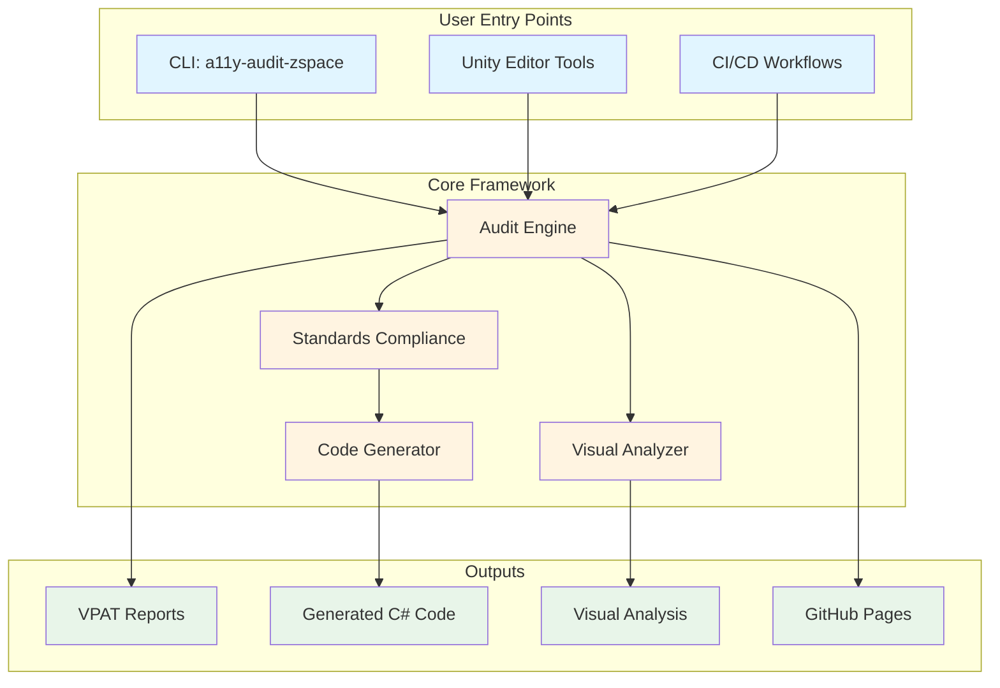

---

## System Components

### 1. CLI Tools (`bin/`)

Command-line tools for automated accessibility auditing:

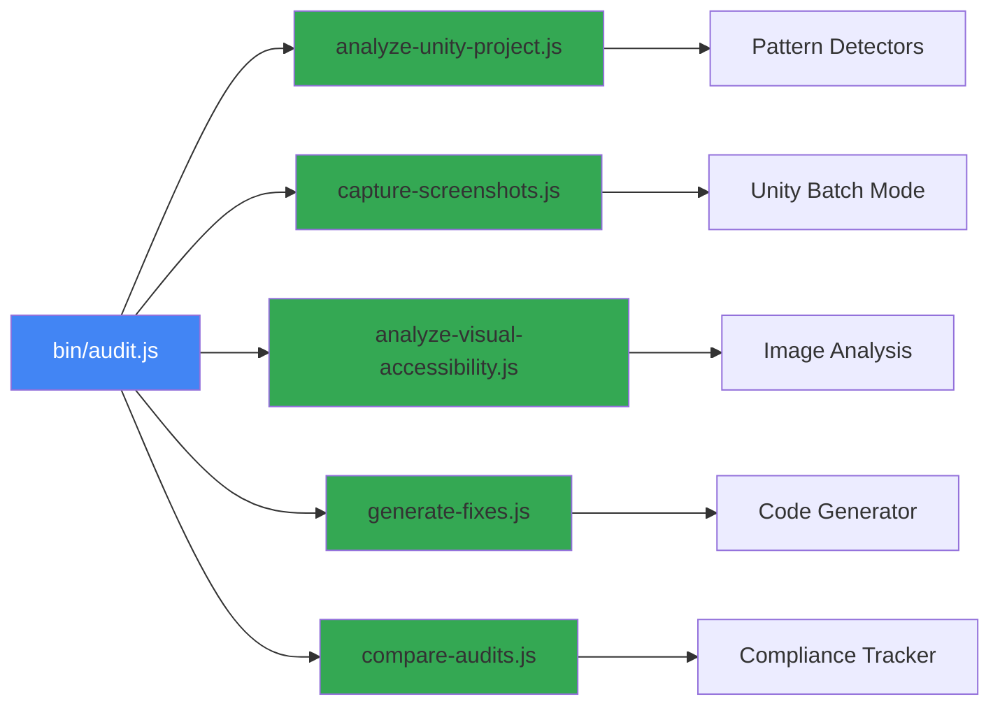

**Key Components:**
- **audit.js**: Main entry point, orchestrates all analysis
- **analyze-unity-project.js**: Scans Unity scenes and scripts
- **capture-screenshots.js**: Unity batch mode screenshot capture
- **analyze-visual-accessibility.js**: Contrast and color-blind analysis
- **generate-fixes.js**: Automated code generation
- **compare-audits.js**: Compliance tracking over time

### 2. Unity Framework (`implementation/unity/`)

Unity C# components and prefabs:

```mermaid
graph TB
    subgraph Unity Components
        A[Accessibility Scripts]
        B[Editor Tools]
        C[Prefabs]
        D[Tests]
    end

    subgraph Scripts
        A --> E[AccessibleStylusButton.cs]
        A --> F[KeyboardNavigationManager.cs]
        A --> G[UnityAccessibilityIntegration.cs]
        A --> H[DepthPerceptionAlternatives.cs]
    end

    subgraph Editor
        B --> I[AccessibilityAuditorWindow.cs]
        B --> J[AccessibilityValidator.cs]
    end

    subgraph Prefabs
        C --> K[AccessibleButton.prefab]
        C --> L[FocusIndicator.prefab]
        C --> M[ScreenReaderAnnouncer.prefab]
    end

    subgraph Tests
        D --> N[PlayMode Tests]
        D --> O[EditMode Tests]
    end

    style A fill:#ff6d00
    style B fill:#ffa000
    style C fill:#ff6d00
    style D fill:#ffa000
```

### 3. Standards Engine (`standards/`)

Compliance validation against accessibility standards:

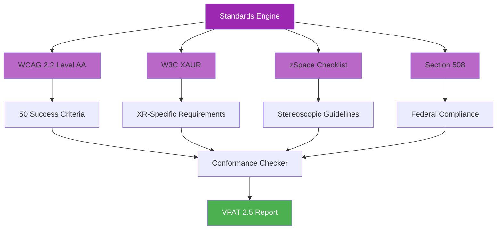

---

## Data Flow

### Complete Audit Workflow

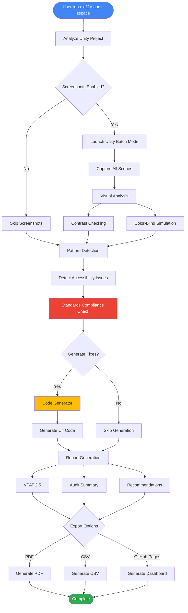

### Screenshot Capture Flow

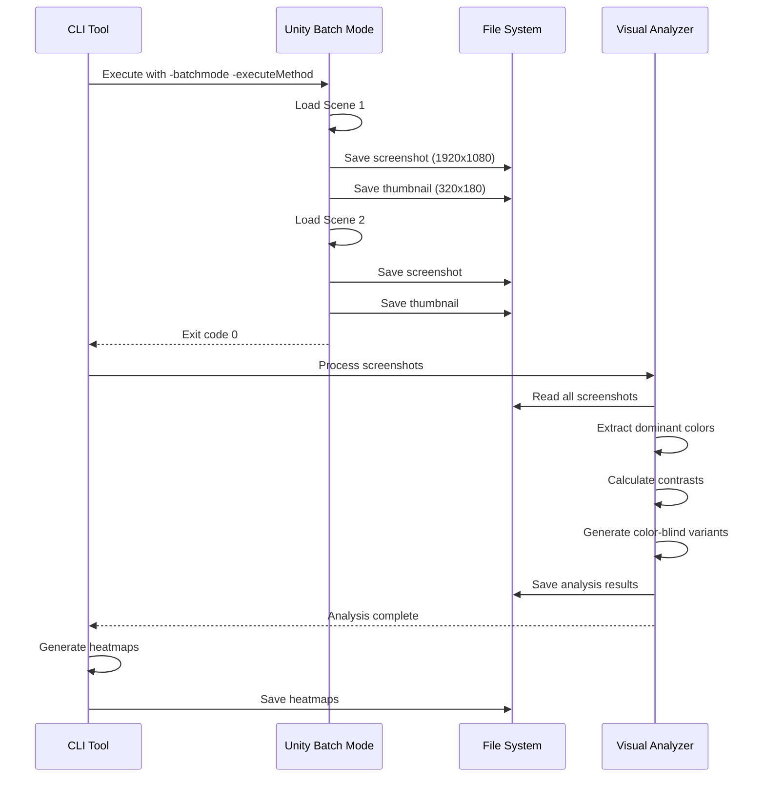

---

## CLI Tools Architecture

### Pattern Detection System

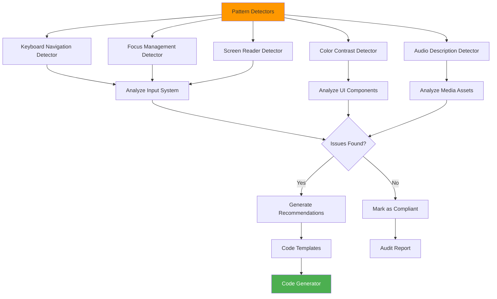

### Code Generation Pipeline

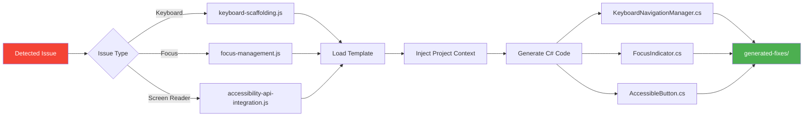

---

## Unity Framework Architecture

### Accessibility Component Hierarchy

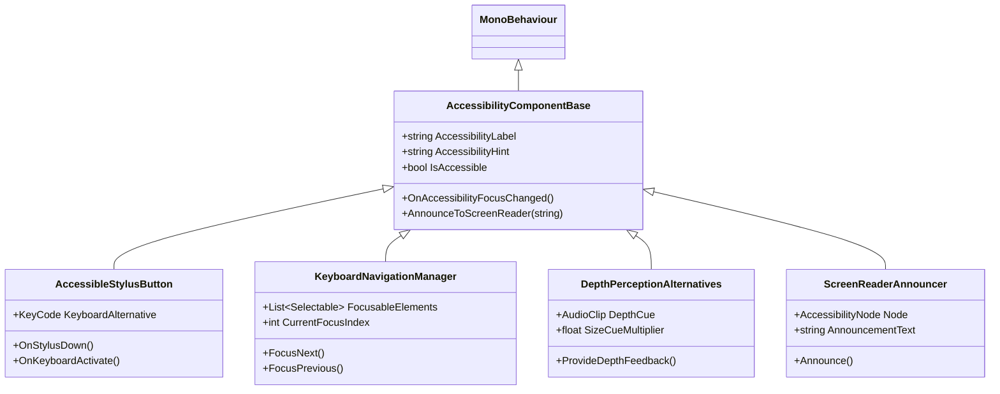

### Unity Editor Integration

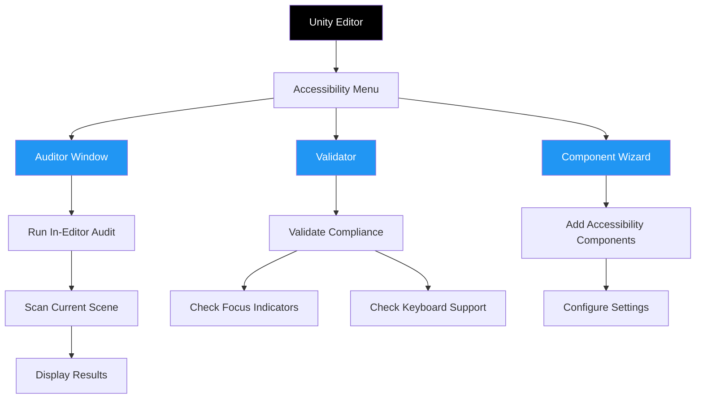

---

## Standards Engine

### Compliance Validation Flow

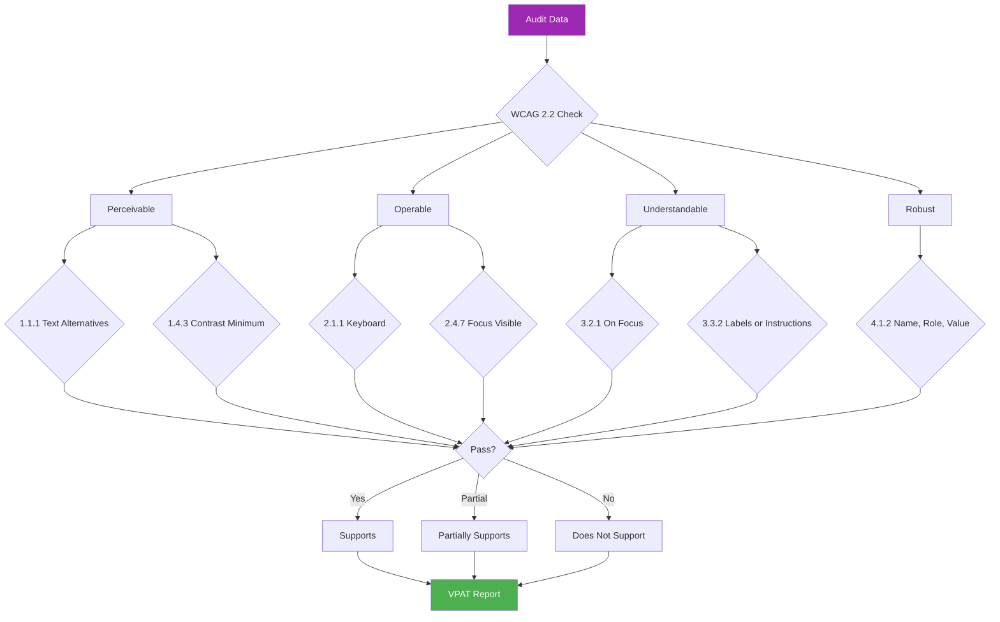

---

## CI/CD Integration

### GitHub Actions Workflow

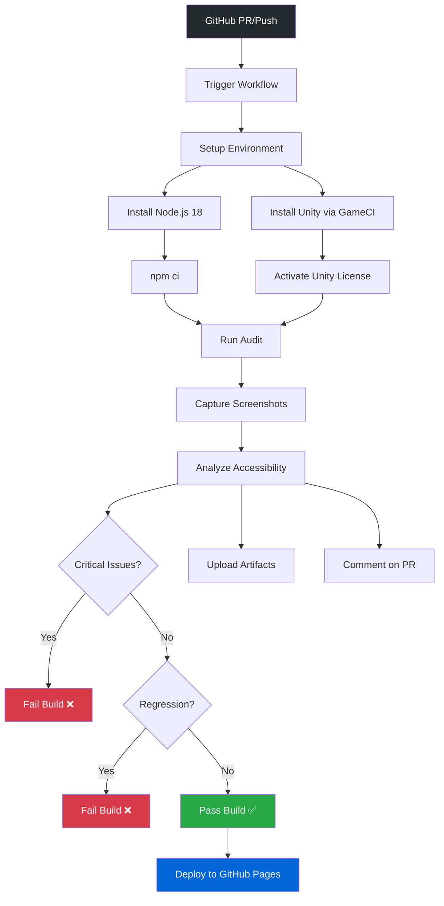

### Multi-Platform Support

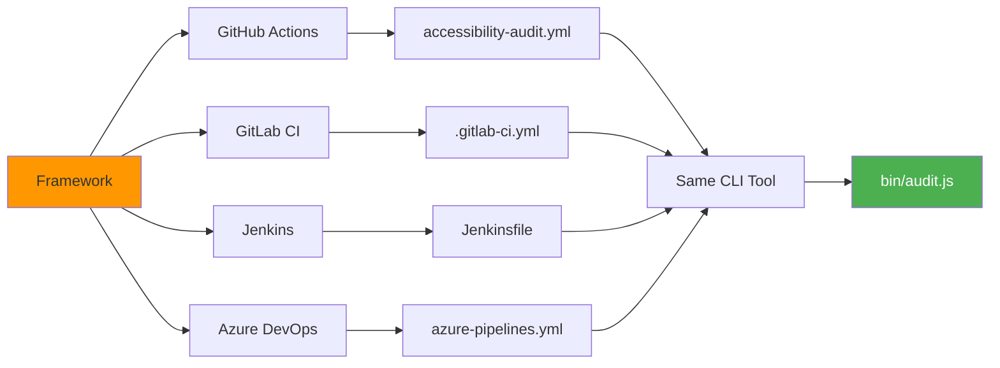

---

## Technology Stack

### Runtime Dependencies

```mermaid
graph TB
    A[Node.js 18 LTS] --> B[Core CLI]

    B --> C[sharp ^0.33.0]
    B --> D[puppeteer ^23.0.0]
    B --> E[marked ^15.0.0]
    B --> F[csv-writer ^1.6.0]
    B --> G[@octokit/rest ^21.0.0]
    B --> H[color-contrast-checker ^2.1.0]

    C --> I[Screenshot Analysis]
    D --> J[PDF Generation]
    E --> K[Markdown Rendering]
    F --> L[CSV Export]
    G --> M[GitHub API]
    H --> N[WCAG Contrast]

    style A fill:#026e00,color:#fff
    style B fill:#68a063
```

### Unity Dependencies

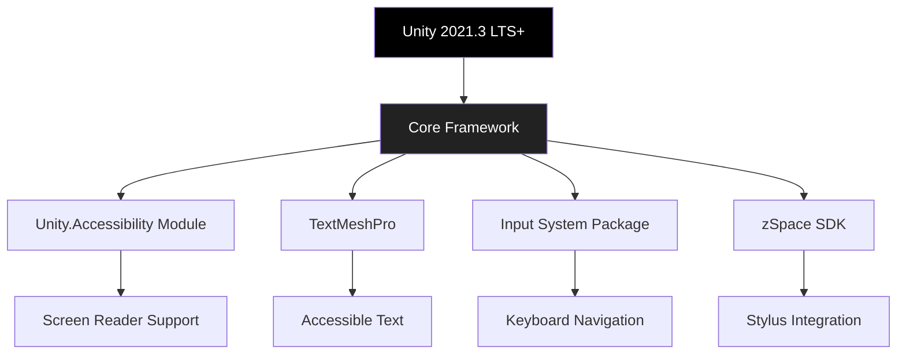

---

## Repository Structure

```
accessibility-standards-unity/
│
├── bin/                           # CLI Tools (Node.js)
│   ├── audit.js                   # Main audit orchestrator
│   ├── analyze-unity-project.js   # Unity project analyzer
│   ├── capture-screenshots.js     # Screenshot capture
│   ├── analyze-visual-accessibility.js  # Visual analysis
│   ├── generate-fixes.js          # Code generation entry
│   ├── compare-audits.js          # Compliance tracking
│   ├── pattern-detectors/         # Issue detection
│   └── code-generator/            # Code generation templates
│
├── implementation/unity/          # Unity Framework (C#)
│   ├── scripts/                   # Accessibility components
│   ├── prefabs/                   # Reusable UI prefabs
│   ├── editor/                    # Unity Editor tools
│   └── tests/                     # Unity Test Framework
│
├── standards/                     # Compliance Standards
│   ├── WCAG-2.2-LEVEL-AA.md       # WCAG 2.2 criteria
│   ├── XR-ACCESSIBILITY-REQUIREMENTS.md  # W3C XAUR
│   └── ZSPACE-ACCESSIBILITY-CHECKLIST.md # zSpace guidelines
│
├── templates/                     # Report & Code Templates
│   ├── audit/                     # VPAT, summary templates
│   └── code/                      # C# code templates
│
├── docs/                          # Documentation
│   ├── ARCHITECTURE.md            # This file
│   ├── CI-CD-INTEGRATION.md       # CI/CD guide
│   └── planning/                  # Internal planning
│
├── .github/workflows/             # GitHub Actions
│   ├── accessibility-audit.yml    # PR audit workflow
│   └── publish-reports.yml        # GitHub Pages deployment
│
└── workflows/                     # User Workflows
    ├── DEVELOPER-WORKFLOW.md      # For Unity developers
    ├── DESIGNER-WORKFLOW.md       # For UI/UX designers
    ├── QA-WORKFLOW.md             # For QA engineers
    └── PRODUCT-OWNER-WORKFLOW.md  # For product owners
```

---

## Design Principles

### 1. **Separation of Concerns**
- CLI tools (Node.js) separate from Unity framework (C#)
- Standards definitions separate from validation logic
- Allows independent updates and testing

### 2. **Extensibility**
- Plugin-based pattern detection system
- Template-based code generation
- Modular standards compliance checkers

### 3. **Automation First**
- Automated auditing reduces manual effort from 79.3% → 20%
- CI/CD integration catches regressions early
- Code generation provides working solutions

### 4. **Platform Agnostic**
- Supports 4 major CI/CD platforms
- Works with Unity 2021.3 LTS through 2023.2+
- Cross-platform Node.js CLI tools

### 5. **Standards Compliant**
- WCAG 2.2 Level AA (50 criteria)
- W3C XAUR for XR accessibility
- Section 508 federal compliance
- VPAT 2.5 professional reporting

---

## Performance Characteristics

| Metric | Value | Notes |
|--------|-------|-------|
| **Basic Audit** | < 1 second | No screenshots, pattern detection only |
| **Full Audit** | 5-15 minutes | Screenshots + visual analysis + code gen |
| **Screenshot Capture** | ~10 sec/scene | Unity batch mode per scene |
| **Visual Analysis** | ~3 sec/scene | Contrast + color-blind simulation |
| **Code Generation** | < 5 seconds | All detected issues |
| **PDF Export** | ~10 seconds | Puppeteer rendering |
| **CI/CD Overhead** | ~2 minutes | Unity activation + npm install |

---

## Future Architecture Considerations

### Planned Enhancements

1. **Machine Learning Integration**
   - AI-powered pattern detection
   - Predictive compliance scoring
   - Automated fix suggestions

2. **Real-Time Monitoring**
   - Live accessibility checks in Unity Editor
   - Real-time VPAT updates
   - Continuous compliance dashboard

3. **Cloud Processing**
   - Offload screenshot capture to cloud
   - Distributed visual analysis
   - Centralized compliance tracking

4. **Plugin Ecosystem**
   - Third-party pattern detectors
   - Custom code generators
   - Industry-specific standards

---

## References

- **WCAG 2.2**: https://www.w3.org/TR/WCAG22/
- **W3C XAUR**: https://www.w3.org/TR/xaur/
- **Unity Accessibility**: https://docs.unity3d.com/Manual/com.unity.modules.accessibility.html
- **VPAT 2.5**: https://www.itic.org/policy/accessibility/vpat

---

**Document Version**: 1.0
**Last Updated**: October 27, 2025
**Framework Version**: 3.1.0
**Maintained By**: @jdonnelly-zspace
